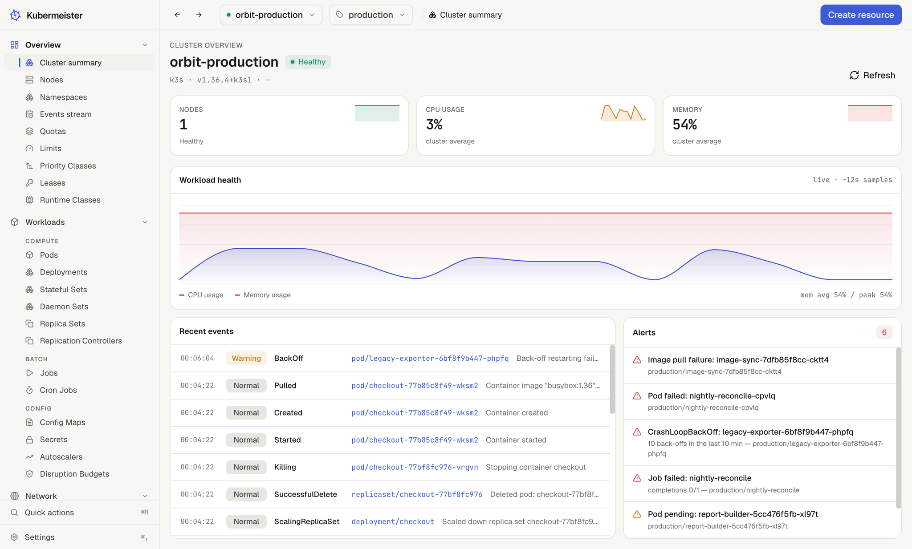
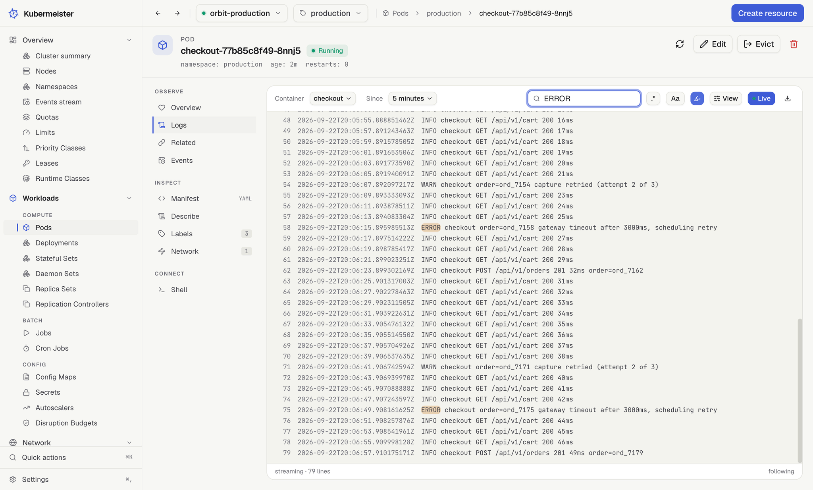
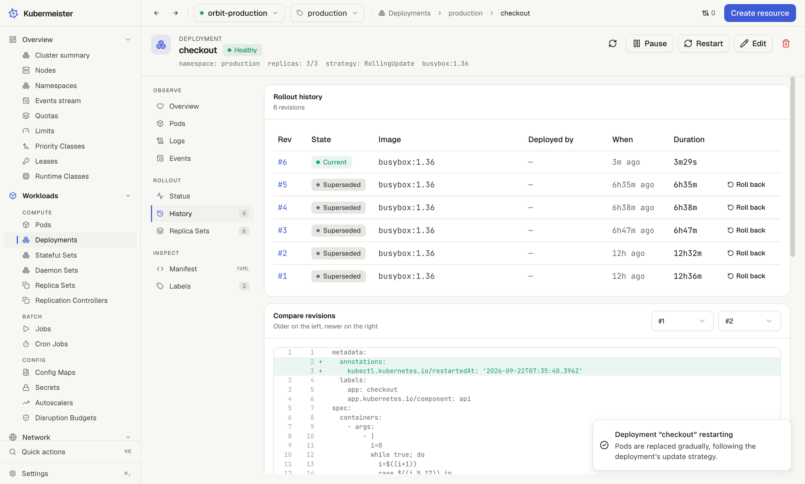
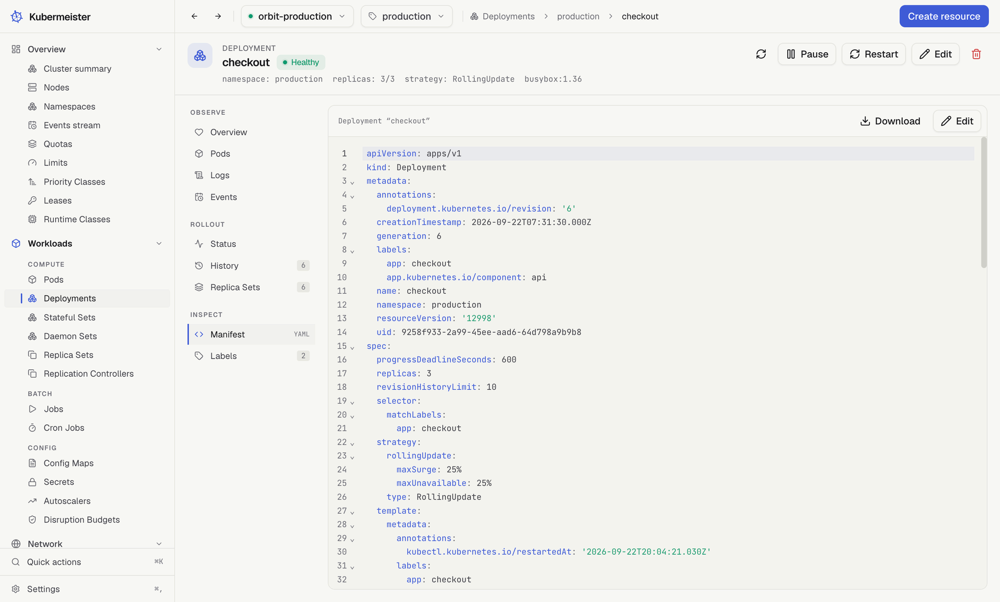

# Kubermeister

[](https://github.com/kubermeister/kubermeister/actions/workflows/ci.yml)
[](https://github.com/kubermeister/kubermeister/releases/latest)
[](LICENSE)

A fast, native desktop client for Kubernetes, for macOS, Windows and Linux.

Kubermeister reads the kubeconfig you already have and needs nothing else: no `kubectl`, no
plugins, no agent in the cluster. Every screen follows the API server's own watches, so what you see
is what the cluster is doing now.

**[Website](https://kubermeister.dev)** · **[Documentation](https://kubermeister.dev/docs/)** ·
**[Download](https://kubermeister.dev/download/)** · **[Changelog](CHANGELOG.md)**

<picture>
  <source media="(prefers-color-scheme: dark)" srcset="docs/screenshots/dark/summary.webp">
  
</picture>

## Highlights

- **Every kind, one way.** Workloads, networking, storage, access control, Helm releases and any
  custom resource, in live lists that stay fast on clusters with thousands of pods.
  [Browsing](https://kubermeister.dev/docs/browse/lists/)
- **Logs, shells and port forwards.** Follow one pod or every pod a workload owns, open a shell in a
  container, and forward a port to a pod or a Service.
  [Sessions](https://kubermeister.dev/docs/sessions/logs/)
- **Rollouts you can read.** Rollout status and history, a side-by-side diff of any two revisions,
  and a rollback that really undoes the change.
  [Deployments and rollouts](https://kubermeister.dev/docs/workloads/rollouts/)
- **Changes made carefully.** Edit a manifest checked against the cluster's own schema as you type,
  dry-run it before you apply it, and never act on a cluster the screen no longer shows.
  [Writing to the cluster](https://kubermeister.dev/docs/workloads/writing/)
- **Operations.** Cordon and drain nodes with a plan you read first, see Helm releases with a health
  roll-up, and get alerts and usage charts from metrics-server.
  [Nodes](https://kubermeister.dev/docs/operations/nodes/)
- **Stays out of the way.** The kubeconfig is only ever read, nothing is installed in the cluster,
  and Secret values are revealed one key at a time.
  [Security](https://kubermeister.dev/docs/reference/security/)

<table>
  <tr>
    <td width="33%">
      <picture>
        <source media="(prefers-color-scheme: dark)" srcset="docs/screenshots/dark/pod-logs.webp">
        
      </picture>
    </td>
    <td width="33%">
      <picture>
        <source media="(prefers-color-scheme: dark)" srcset="docs/screenshots/dark/deployment-compare.webp">
        
      </picture>
    </td>
    <td width="33%">
      <picture>
        <source media="(prefers-color-scheme: dark)" srcset="docs/screenshots/dark/manifest-editor.webp">
        
      </picture>
    </td>
  </tr>
</table>

## Install

Download the installer for your platform from the
[latest release](https://github.com/kubermeister/kubermeister/releases/latest):

| Platform | Download                                                 | Updates                                 |
| -------- | -------------------------------------------------------- | --------------------------------------- |
| macOS    | `mac-arm64.dmg` (Apple silicon) or `mac-x64.dmg` (Intel) | In the app; `brew upgrade` for Homebrew |
| Windows  | `win-x64.exe`                                            | In the app                              |
| Linux    | `linux-x86_64.AppImage` or `linux-arm64.AppImage`        | In the app                              |
| Linux    | `linux-amd64.deb` or `linux-arm64.deb`                   | Install the new `.deb`                  |

Or from a terminal:

```sh
# macOS, Homebrew
brew trust kubermeister/tap
brew install --cask kubermeister/tap/kubermeister

# Linux, AppImage
chmod +x Kubermeister-*-linux-x86_64.AppImage && ./Kubermeister-*-linux-x86_64.AppImage

# Debian and Ubuntu
sudo apt install ./Kubermeister-*-linux-amd64.deb
```

The macOS builds are signed and notarized. The Windows installer is not signed yet, so SmartScreen
asks once: choose **More info**, then **Run anyway**. Every release comes with a `SHA256SUMS` file to
check a download against. [Install Kubermeister](https://kubermeister.dev/docs/start/install/) has
the details for each platform, and [your first five minutes](https://kubermeister.dev/docs/start/first-cluster/)
is a short tour once it is running.

### Requirements

- macOS 13 or newer, Windows 10 or newer, or a Linux distribution on x64 or arm64.
- A kubeconfig with at least one context. Credential plugins such as cloud provider logins run the
  way they do for `kubectl`.
- Optionally, [metrics-server](https://github.com/kubernetes-sigs/metrics-server) for usage figures
  and charts. Everything else works without it.

## Configuration

Settings are a file you own, `~/.config/kubermeister/settings.json`, on every operating system. Every
key is optional, and a change made in the app rewrites only that key, so the file can live with your
dotfiles. A [JSON Schema](settings.schema.json) gives your editor completion and checks. Every key is
listed in [the settings reference](https://kubermeister.dev/docs/reference/settings/).

## Building from source

You need Node.js 24 and npm 11.19 or newer.

```sh
git clone https://github.com/kubermeister/kubermeister.git
cd kubermeister
npm install
npm run dev
```

[CONTRIBUTING.md](CONTRIBUTING.md) covers the checks a change has to pass, the test suites and the
branch and commit conventions. [AGENTS.md](AGENTS.md) documents the architecture and the rules the
codebase holds itself to. No test ever touches a real cluster or your kubeconfig.

## Contributing

Issues and pull requests are welcome. The
[bug report](https://github.com/kubermeister/kubermeister/issues/new?template=bug_report.yml) form
asks for what a fix needs, and issues labelled
[`good first issue`](https://github.com/kubermeister/kubermeister/issues?q=is%3Aissue%20is%3Aopen%20label%3A%22good%20first%20issue%22)
are a place to start. Ideas go to the
[Ideas discussions](https://github.com/kubermeister/kubermeister/discussions/categories/ideas).
Report security problems through [SECURITY.md](SECURITY.md), never in a public issue.

## License

[MIT](LICENSE)
